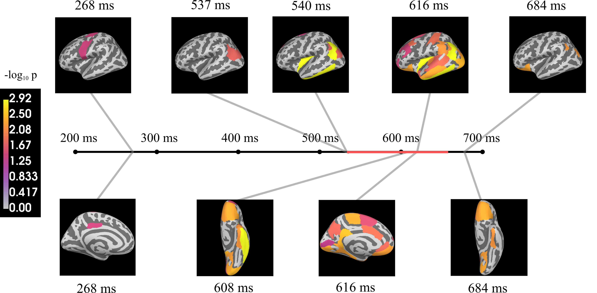
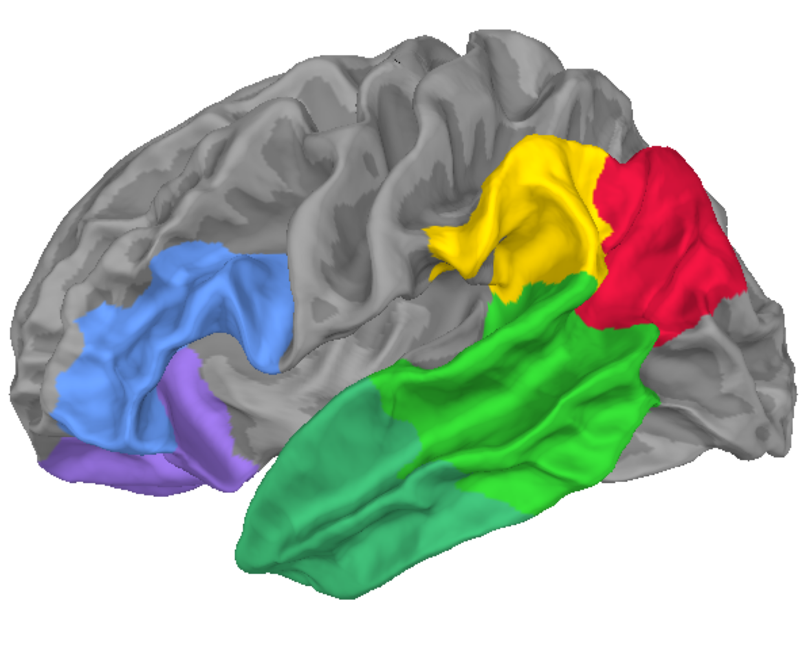
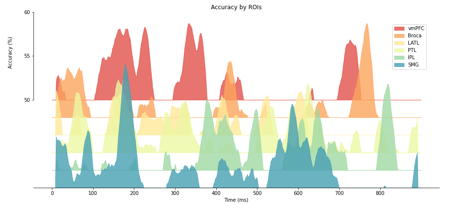

# Master’s project: 'Mind Reading' with MEG and Machine Learning

## Abstract
*Can we read the thoughts by looking at the neural signals produced by the brain?*

Reading complex thoughts is clearly 
still beyond the scope of our technology (for better or for worse). In this Master’s project our aim is much simpler:
we wish to predict whether the person is thinking of a noun (or object-like imagery) as opposed to verb 
(or action-like imagery).

To this end, we will use magnetoencephalography (MEG), a technology designed to read magnetic fields created 
by the current produced by neurons in real-time. The signal obtained will then be analysed with a Machine Learning 
algorithm to classify noun vs. verb condition.

The results show that **we can indeed 'read minds'**. In particular, we observe specific patterns of activation in 
what is known as *Episodic Memory Network* which is thought to process episodic memories.

## Spatio-temporal pattern of significant decoding

## Regions of Interest (ROI)

## Decoding performances in ROIs

## Top level workflow
* Preprocessing (per subject)
* Dataset generation (per cortical area + sensor space)
* Adding conditions (per condition type)
* MVPA analyses (per analysis)

# Per subject (preprocessing.py)
* **create_directories()**
  * => bunch of directories
* **read_raw()**
  * => raw object
* **downsample()** (optional)
  * => downsampled raw object
* **filter()** (optional)
  * => filtered raw object
* **remove_artifacts()** (optional)
  * => raw object without artifacts
* **epoch()**
  * => epoch file
  * => sensor space data
* **source_localize()**
  * => source space data

    
# Per cortical area (dataset.py)
* **generate_area_data()**/**generate_area_data_mmap()**

NB: round nodes are optional

