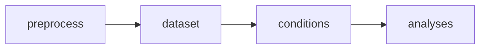

# Events Preprocessing

In the Mother of All Unification (MOUS) dataset the events are organised
according to sentences. If we want to analyse at finer level (words, 
syllables, phonemes etc.) we need to create a custom event labels.

`events` package is designed to deal with the problem of reformatting 
the original `...events.tsv` into a usable set of labels.

## Formatting

| onset | duration | sample | type               | value  |
|-------|----------|--------|--------------------|--------|
| 0     | 10       | 1      | trial              | n/a    |
| 4.01  | n/a      | 4814   | frontpanel trigger | 10     |
TODO: CONTINUE

This format is not particularly useful for our purposes.

`format_event_data()` can serve to reformat in more usable format.
It takes paths to `...events.tsv` file (for each subject) and `stimuli.txt`
It formats the events file into the format:

| sample | type | onset | form               | sentence | position | ID  |
|--------|------|-------|--------------------|----------|----------|-----|
| ??     | ??   | ??    | ??                 | ??       |          |     |

`sample`: sampling index TODO: why do we need this?

`type`: either `word`, `block`, or `empty`. Only `word` is relevant for this project

`onset`: onset time in seconds

`form`: actual word form, e.g. `zijn`

`sentence`: sentence ID to identify exact sentence

`ID`: word ID

## Event Validation
MOUS dataset seems to contain some errors either in the `tsv` file or in event channels 
in the `CTF` file. We need to make sure that both event information are consistent with
each other. 

TODO: THE REST

