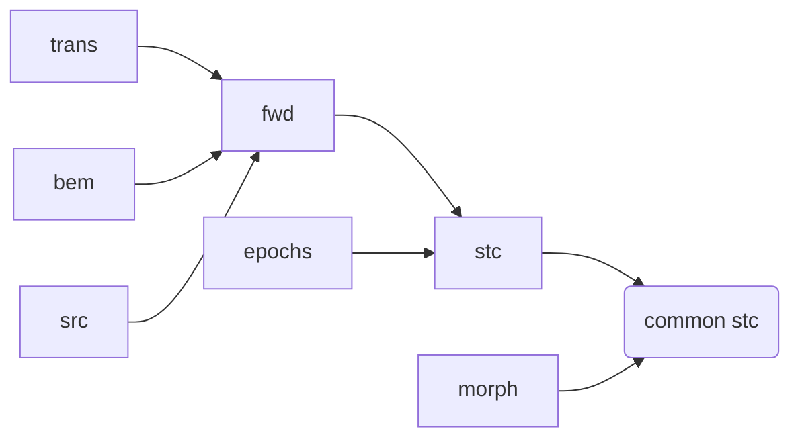

# Source Localization
We want to perform decoding in the source space. For this, we need
to estimate the source signals from sensor measurements.

To this end, following steps must be followed:
1. anatomical reconstruction (with freesurfer)
2. coregistration (calculate `trans`)
3. calculate BEM (`bem`)
4. calculate source space (`src`)
5. create forward operator (`fwd`)
6. source localization (minimum norm estimate)
7. morph to common space

## 1. Anatomical reconstruction
If we have structural MRI image (sMRI), we can use that to create a
3D reconstruction of the subject’s brain. For this we use FreeSurfer.
The details can be found here: https://mne.tools/stable/auto_tutorials/forward/10_background_freesurfer.html

Reconstruction can be performed with bash script `reconstruct.sh` in
the `/scripts/bash-scripts` directory.

## 2. Coregistration

* The head coordinate frame, defined through anatomical landmarks of
subjects head (nasion NAS, left and right preauricular points, LPA/RPA).
  * digitization (Polhemus)
* MEG device coordinate frame
  * measured at the beginning of the session
  * stored in `raw.info['dev_head_t']`
* MRI coordinate frame, 
  * `head` <-> `MRI`, transformation, known as `trans`

### 2.1. Manually Generate `trans`
See video tutorial: https://www.youtube.com/watch?time_continue=277&v=ALV5qqMHLlQ&feature=emb_logo
And text tutorial: https://mne.tools/stable/auto_tutorials/forward/20_source_alignment.html#defining-the-headmri-trans-using-the-gui

### 2.2. Automated Approach to Calculating `trans`
Use `get_trans` to automatically calculate the `trans` matrix. 
Arguments needed are `subject name`, `subjects_dir` and `mne.Info`.
See https://mne.tools/stable/auto_tutorials/forward/25_automated_coreg.html

## 3. Calculate BEM surfaces
To calculate BEM surfaces use the script `make-bem.sh` in the directory `scripts/bash-scripts`
See https://mne.tools/stable/auto_tutorials/forward/30_forward.html

## 4. Calculate Source Space (`src`)
This is done inside the `get_forward()` function.
See https://mne.tools/stable/auto_tutorials/forward/30_forward.html

## 5. Create Forward Operator (`fwd`)
Use `get_forward()` to generate forward solution.
Arguments needed are: `info`, `trans`, `subject` (name), `subjects_dir` and `layers` (should be 1)
See https://mne.tools/stable/auto_tutorials/forward/30_forward.html

## 6. Source Localization (minimum norm estimate)
TODO

## 7. Morph to Common Space
TODO
