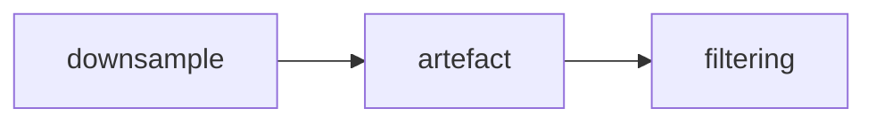

# Preprocessing
Before the data can be analysed there are few things that need to be done for them to be usable.

The main steps are:
1. downsampling
2. artefact removal
3. filtering

## 1. Downsampling
TODO
## 2. Artefact Removal
TODO
## 3. Filtering
TODO